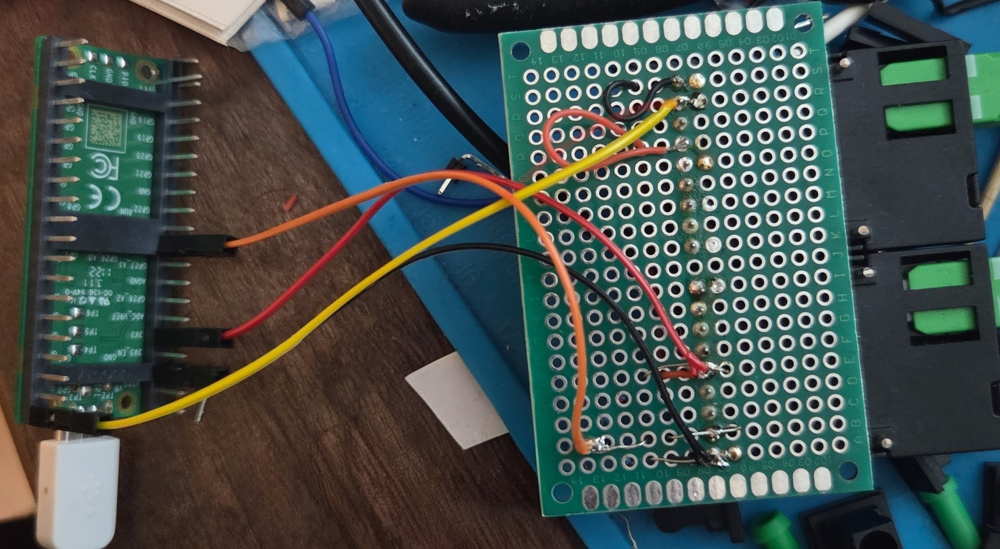
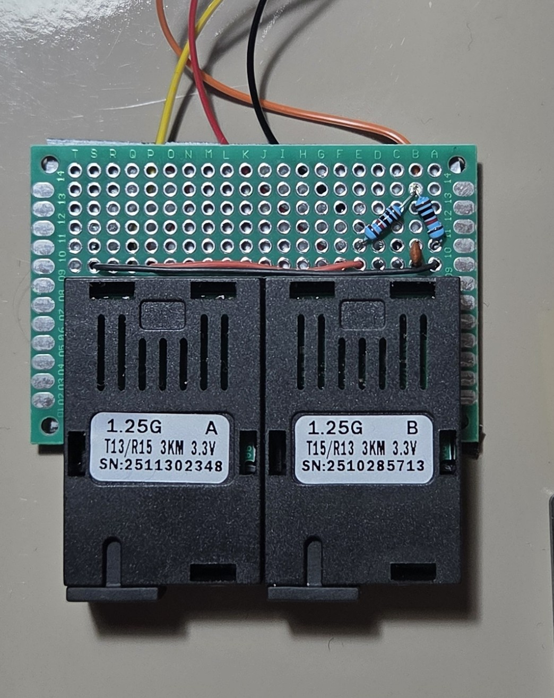
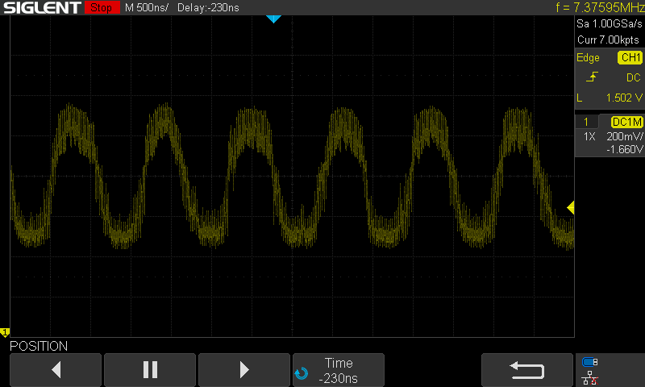
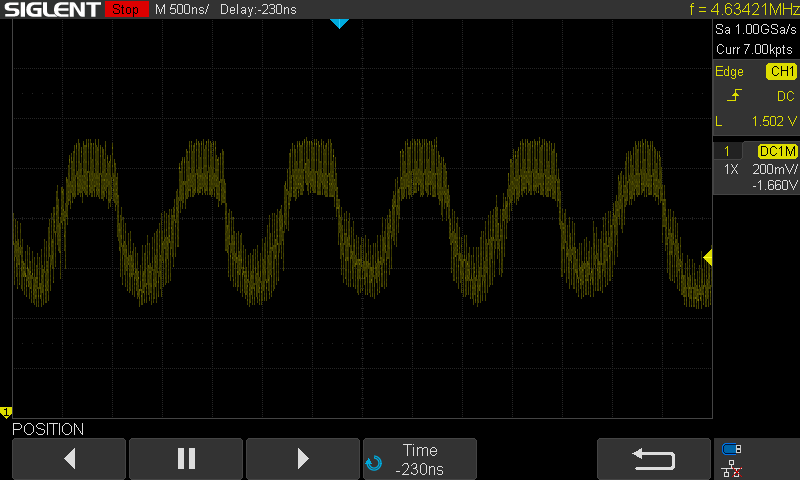
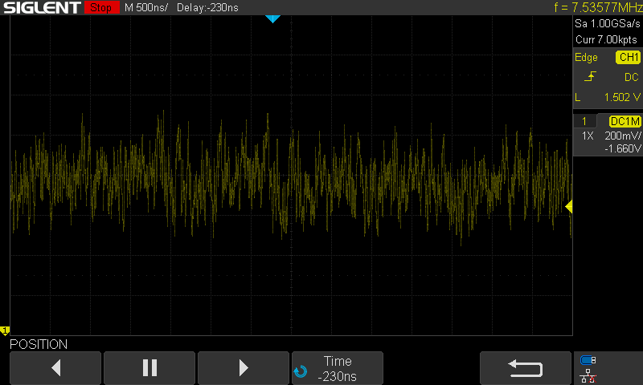
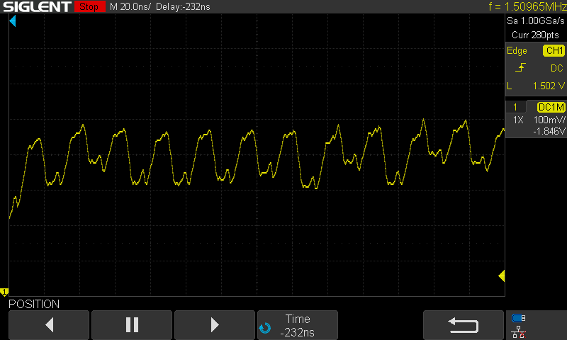
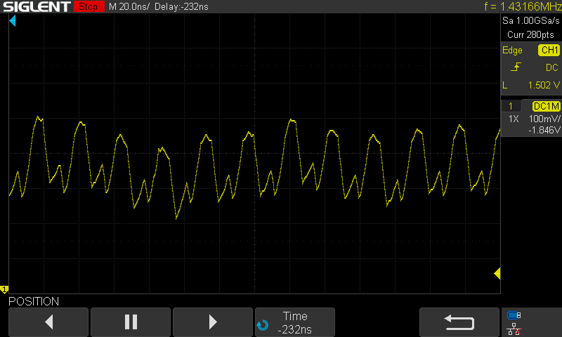
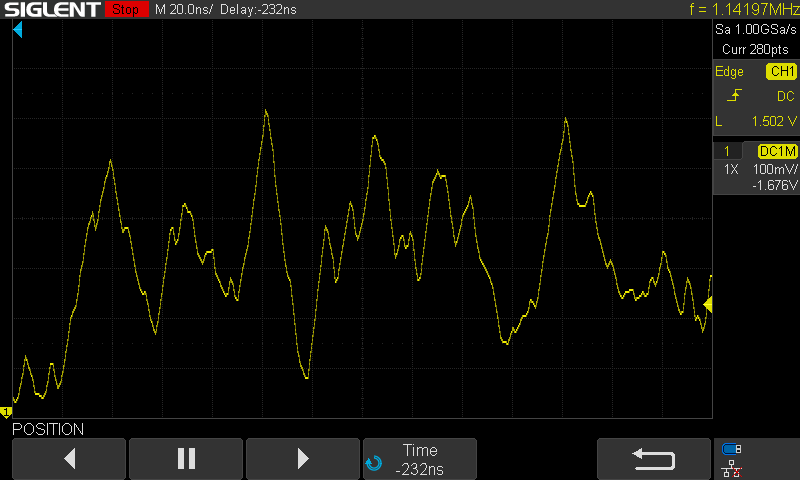
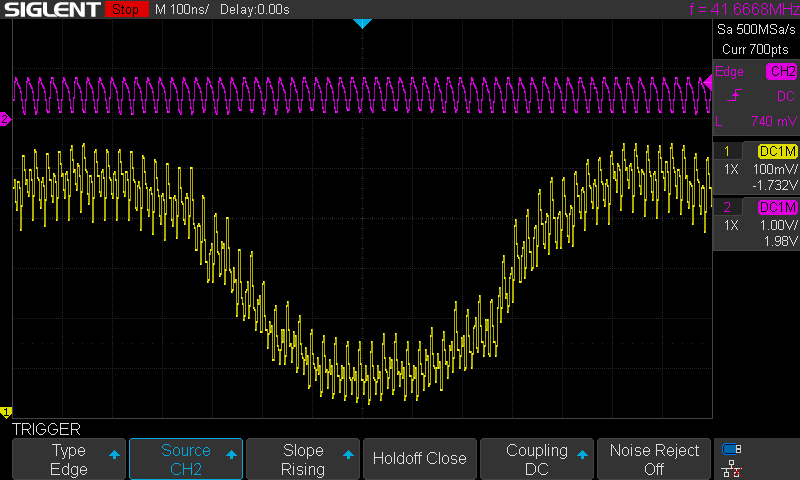
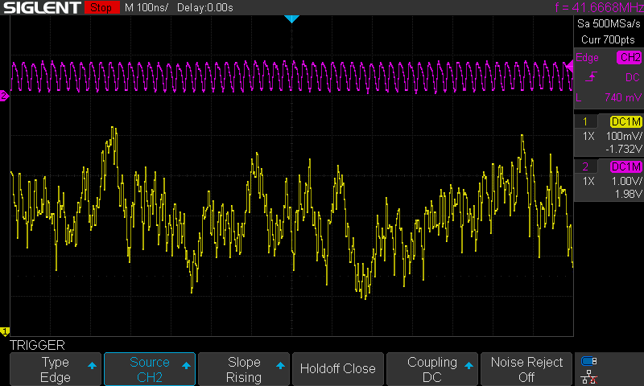

```
__/\\\\\\\\\\\\\\\________/\\\_______________________________________________                     
 _\/\\\///////////________\/\\\_______________________________________________                    
  _\/\\\______________/\\\_\/\\\_______________________________________________                   
   _\/\\\\\\\\\\\_____\///__\/\\\____________/\\\\\\\\___/\\/\\\\\\\____________                  
    _\/\\\///////_______/\\\_\/\\\\\\\\\____/\\\/////\\\_\/\\\/////\\\___________                 
     _\/\\\_____________\/\\\_\/\\\////\\\__/\\\\\\\\\\\__\/\\\___\///____________                
      _\/\\\_____________\/\\\_\/\\\__\/\\\_\//\\///////___\/\\\___________________               
       _\/\\\_____________\/\\\_\/\\\\\\\\\___\//\\\\\\\\\\_\/\\\___________________              
        _\///______________\///__\/////////_____\//////////__\///____________________             
____/\\\\\\\\\____________________________________________________________________________        
 __/\\\///////\\\__________________________________________________________________________       
  _\/\\\_____\/\\\__________________________________/\\\\\\\\_______________________________      
   _\/\\\\\\\\\\\/_____/\\\\\\\\\_____/\\/\\\\\\____/\\\////\\\_____/\\\\\\\\___/\\/\\\\\\\__     
    _\/\\\//////\\\____\////////\\\___\/\\\////\\\__\//\\\\\\\\\___/\\\/////\\\_\/\\\/////\\\_    
     _\/\\\____\//\\\_____/\\\\\\\\\\__\/\\\__\//\\\__\///////\\\__/\\\\\\\\\\\__\/\\\___\///__   
      _\/\\\_____\//\\\___/\\\/////\\\__\/\\\___\/\\\__/\\_____\\\_\//\\///////___\/\\\_________  
       _\/\\\______\//\\\_\//\\\\\\\\/\\_\/\\\___\/\\\_\//\\\\\\\\___\//\\\\\\\\\\_\/\\\_________ 
        _\///________\///___\////////\//__\///____\///___\////////_____\//////////__\///__________
```

**An open source Phase-Diffusion Quantum Random Number Generator**

## Randomness from Vacuum Fluctuations

When a laser diode powers up, there are quantum fluctuations that occur that later determine the laser's current polarization during operation. This means that if we pulse a laser diode on, then off long enough to let it totally power down, and then repeat, each pulse has unique and 'quantum random'-ly determined properties. 

We can send these pulses into an optical fiber network, and split the pulse so that ~50% goes to the detector, and the rest gets sent to a delay line - here, we use 5m length of fiber as our photonic delay line. 5m is long enough that with the timing of our pulses (roughly every 24ns) the pulse travelling over the delay loop will interact with the next pulse from the laser diode. 

The fact that each of these are different, and randomly so, means that their interactions are fundamentally chaotic and random. This is great, for a QRNG - and so this is what we estimate and measure. You can see examples of the pulses below. 

Details maybe found in the paper [Ultra-fast quantum randomness generation by accelerated phase diffusion in a pulsed laser diode](https://opg.optica.org/oe/fulltext.cfm?uri=oe-22-2-1645) by Abellán et al.

## System Overview

Here's an overview flowchart of what's going on in this system:


### Software Overview

There are three parts to this system; the PIO program, the ADC acquisition code, and the min-entropy calculation and hashing code communicating over UART over USB.

The Pi Pico is overclocked to its maximum speed of 250MHz. This gives us 125MHz maximum pulse frequency, However, given the laser diode has to completely desaturate between pulses in order for the vacuum fluctuations to be utilized, we pulse once for 4ns, then rest for 20ns. Whilst this ends up requiring a longer delay line, it amplifies the effect we are trying to utilize by guaranteeing desaturation of the emitter. 

The PIO code sets is as follows:

```c
.wrap_target
    set pins, 1 
    set pins, 0 [4]
.wrap
```

The code on core 0 is the ADC acquisition code. It reads the signal that is biased at 1.65V, exactly in the center of the Pico's 3.3V ADC range. The ADC is 12-bit, meaning our readings are centered around the value 2048, with a maximum of 4096. The ADC measurements are collected in window arrays of length 1024 `int` values, and passed through a blocking write to an array owned by core 1. 

Core 1 runs the min-entropy calculation code and manages UART communications. It performs an optimized min-entropy calculation that performs a lagged look-around analysis to generate a histogram of delta difference values for each of the measurements. This normalizes the calculation from being 'peak heavy' from the pulsed nature of the randomness, and attempts to avoid any incidental features from the 500kHz max speed of the Pico's ADC. Given we are using a window of 1024 (2^10) samples, the maximum value for min-entropy is 10. The min-entropy calculation code is as follows:

```c
for(int i = 0; i < BATCH_SIZE; i++) {
    // Mask to ensure we only look at 12 bits
    uint16_t val = batch.samples[i] & 0xFFF;
    
    // --- Update Min/Max (Raw Data) ---
    if (val < min_val) min_val = val;
    if (val > max_val) max_val = val;
    // ---------------------------

    // --- LAGGED DERIVATIVE CALCULATION ---
    // 1. Get the "Old" value from history
    uint16_t old_val = history[hist_head];
    
    // 2. Overwrite history with current value
    history[hist_head] = val;
    
    // 3. Advance the ring buffer head
    hist_head = (hist_head + 1) % LAG_DEPTH;

    // 4. Calculate Delta against the OLD value
    // We add 2048 to center the result.
    uint16_t delta = (val - old_val + 2048) & 0xFFF;
    // -------------------------------------

    // Update Histogram using DELTA
    if(counts[delta] < 65535) counts[delta]++; 
    if(counts[delta] > max_count) {
        max_count = counts[delta];
    }
}

// Calculate Min-Entropy
float min_entropy = 10.0f - log2f((float)max_count);

// Calculate Range
uint16_t dynamic_range = max_val - min_val;
```

## Hardware

### Bill of Materials

**Optics:**

* 2x fiber splitters - 1x2 or 2x2
* 1x Delay line (5 meters)
* Optical connectors

For our assembly, we use SC/APC fiber connectors. These are square with angled ends that minimize reflections at any interfaces. 

**Electronics:**

* 1x Raspberry Pi Pico (or Pico 2)
* 1x Prototype Board
* 1x pair of fiber optic transceivers
* 1x 10nF ceramic capacitor
* 2x 10k Ohm resistors (through hole)
* 1x prototyping board
* Assorted connection wires

Many optical transcievers transmit/receive on 1310/1550nm or tx/rx at 1550/1310nm. (1310nm is in O-band and 1550nm is in C-band in conventional fiber optic parlance). 

### Prototype Board Assembly

The following summarises the pin assignments for the Pico:

* `GPIO0` is used as the laser driver. A PIO program is run to offload this from the CPI.
* `ADC0` is used to read the data from the receiver, running on core 0
* The USB port is used to analyse and generate the final randomness and min-entropy outputs, and is controlled from core 1. 

### Optical Assembly

This is a sketch overview of the RPi pico driver, laser/PD and splitter setup. The Delay Loop used below is 5m in length.


This is what the system looks like in hardware:


### Circuit Details

`GPIO0` and `ADC0` are used on the RPi Pico. Here are more details:

* The `3V3` and `GND` pins (3rd and 5th on RHS) are used to power the two fiber modules.
* Both an A and a B module are used - one transmits at 1310 and receives at 1510, the other at 1510 and receives at 1310.
* Pin 8 on the A module (`TX` positive pin) is used to drive the laser.
* Pin 2 on the B module (`RX` positive pin) is used to receive.
* Between this `RX` pin and the `ADC0` pin, there is a small circuit that normalizes the voltage from being centered around 0V to being centered around 1.65V. This circuit is comprised of:
    * 2x 10k Ohm resistors are used. On is connected to `3V3` and the other to `GND` they form a voltage divider the middle of which is tied to `ADC0`.
    * 1x 10nF ceramic capacitor is used - this goes from `RX` to `ADC0` that has the voltage lift from the divider. 

The circuit schematic for the output level shifter looks like this: 


## Bill of Materials

The full BOM is as follows:

1. 1x PAIR Fiber Transcievers - e.g. https://www.aliexpress.com/item/1005005938443917.html
1. 1x 5m fiber patch cable - e.g. https://www.aliexpress.com/item/1005008760544957.html
1. 2x 1x2 50/50 fiber splitters - e.g. https://www.aliexpress.com/item/1005006647801937.html 
1. 3x SC/APC Fiber Couplers - e.g. https://www.aliexpress.com/item/1005008790973325.html
1. 1x Raspberry Pi Pico
1. 1x Prototyping board
1. 2x 10k Ohm Resistors
1. 1x 10nF ceramic capacitor

### Note on Fiber Choices

For our build, we use SC/APC fiber connector parts - these are usually green in colour. SC Connectors are very easy to use and reconfigure, hence they were chosen. Blue SC connectors are UPC, meaning they have flat ends which can cause reflections of signal. SC/APC connectors have an 8 degree angle cut on the end to minimize reflections, which is ideal for our purposes. Yellow fiber cabling is usually patch fiber, which is what we want to use. We use multimode 9/125 fiber in this build - that is 125um diameter with a 9um core. 

The transcievers we use are usually multimode - that is they have one side that transmits on 1310nm and receives on 1510nm frequencies, and the other side receives on 1310nm and transmits on 1510nm light frequencies. We use 1310nm for Tx/Rx, but the choice of which frequency to use is inconsequential.

## Full Build

### Transiever Pinout

The pinout for each transceiver unit is as follows. Pin 1 is the left-most pin when looking down on the top of the device with the fiber pointing away from you. The pinout is as follows:


We will just use the `RD+` and `TD+` pins for Rx/Tx respectively. Note that you have to supply +3.3V to EITHER the `VCCR` on the Rx side and `VCCT` on the Tx side, as they have separate power supplies.

### Build Overview

The Pi Pico uses `ADC0` for Rx and `GPIO0` for Tx - with the 3.3V supply and GND pins powering the units. The overall wiring looks like this from below:



Here is the top view - you can see how the voltage divider and ceramic capacitor:



The capacitor is tied to one side on pin 2 of the receive module, and the other side is tied to the joint between the two resistors in the voltage divider. The push pull of the Rx signal is thereby inverted over the capacitor and shifted to 1.65V, which is the precise middle of the 3.3V `ADC0` range. 

### Fiber Build

The fiber is built exactly as photographed above. The setup is symmetrical, so there is no specified in/out or tx/rx port. The two free ports go to either module.

Remember, the fiber network is essentially an amplifier for the quantum vacuum fluctuations in the laser diode startup.

## Results 

The following show some measurement results off a six metre fiber delay loop in a MZI configuration, with a 38MHz base pulse step with 4 sleep steps following. 

This is the base pulse from the PIO program on `GPIO0`:


Here is the base pulse sent over a 1.5m loop of fiber - 


And here is the full output from the `RX` pin sent to the ADC over the interferometry network:


Here are two zoomed in portions to help show the randomness of the system:


<!-- 
 -->

This is a much zoomed in signal from the receiver:


## But How do we Know It's Quantum?

Suppose we take our transciever setup, and run the Pico as normal. Then let's hook it up to the two splitters. If we just connect one of the fibers between the two, we get the following output trace:



However, if we add both fibers, we get the following trace:



The fact that these are so similar is encouraging, as it means that the two signals are either matching, cancelling out, or adding some more noise from the few extra lengths of fiber.

The following is the output when you add the delay line back between one of the connections between the splitters - the dramatic change in the signal despite the same oscilloscope settings means that we are surely seeing some kind of quantum interference resulting from the vacuum fluctuations in the laser diode startup:



We can look at some zoomed-in versions to see the difference. Here is the signal with one connection between the splitters:



Here is the signal zoomed-in with two arms connected - we can see that the signal is in part amplified and in others slightly variable:



With the delay line included, we can see the randomness in the signal from the interference of the non-matching laser pulses:



### Comparison of PIO Signal to Output

Here is the base signal with the base pulse in purple:



Here is the baseline random signal from the interference with the baseline signal in purple again:



Note that there is a 'peak-y-ness' in the signal that correlates with the baseline somewhat. This is why we use jittered readings to avoid falling into traps around that potential correlation. 

## Entropy Tests

### Running `ent`

On a file with 256 million raw bytes converted from the input, the following result was obtained from running the `ent` entropy test suite, a standard tool in Linux:

```bash
user@qrng:~$ ls -l qrng_dump.bin 
-rw-rw-r-- 1 user user 256000000 Feb  4 14:28 qrng_dump.bin
user@qrng:~$ ent -b ./qrng_dump.bin 
Entropy = 1.000000 bits per bit.

Optimum compression would reduce the size
of this 2048000000 bit file by 0 percent.

Chi square distribution for 2048000000 samples is 0.15, and randomly
would exceed this value 69.96 percent of the times.

Arithmetic mean value of data bits is 0.5000 (0.5 = random).
Monte Carlo value for Pi is 3.141611487 (error 0.00 percent).
Serial correlation coefficient is 0.000025 (totally uncorrelated = 0.0).
user@qrng:~$ 
```

Things of note - Entropy of "around 1 bit per bit" is ideal. Chi-squared values need to be between 0.05 and 0.95, so 0.65 is pretty reasonable. Serial correlation less than 0.00005 is usually considered pretty good, too. 

Calculating >2 digits of pi with randomness is pretty hard - this is for the same reason that `22/7` is such an unreasonably good approximation of pi; the continued fraction of pi has a very large term (292) in it's fourth coefficient (`[3;7,15,1,292...]`). This means that getting `3.1416` vs `3.1415...` (0.0001 off) on a reasonably small dataset is encouraging. 

On this test suite, the randomness is performing pretty well, it seems!

### NIST STS

This is a gold-standard test suite from the NIST standardization people. Here is the output of the full run, showing what parameters were used with `sts-2.1.2` version:

```
user@qrng:~/nist/sts-2.1.2/sts-2.1.2$ ./assess 1000000
           G E N E R A T O R    S E L E C T I O N 
           ______________________________________

    [0] Input File                 [1] Linear Congruential
    [2] Quadratic Congruential I   [3] Quadratic Congruential II
    [4] Cubic Congruential         [5] XOR
    [6] Modular Exponentiation     [7] Blum-Blum-Shub
    [8] Micali-Schnorr             [9] G Using SHA-1

   Enter Choice: 0


                User Prescribed Input File: data.bin

                S T A T I S T I C A L   T E S T S
                _________________________________

    [01] Frequency                       [02] Block Frequency
    [03] Cumulative Sums                 [04] Runs
    [05] Longest Run of Ones             [06] Rank
    [07] Discrete Fourier Transform      [08] Nonperiodic Template Matchings
    [09] Overlapping Template Matchings  [10] Universal Statistical
    [11] Approximate Entropy             [12] Random Excursions
    [13] Random Excursions Variant       [14] Serial
    [15] Linear Complexity

         INSTRUCTIONS
            Enter 0 if you DO NOT want to apply all of the
            statistical tests to each sequence and 1 if you DO.

   Enter Choice: 1

        P a r a m e t e r   A d j u s t m e n t s
        -----------------------------------------
    [1] Block Frequency Test - block length(M):         128
    [2] NonOverlapping Template Test - block length(m): 9
    [3] Overlapping Template Test - block length(m):    9
    [4] Approximate Entropy Test - block length(m):     10
    [5] Serial Test - block length(m):                  16
    [6] Linear Complexity Test - block length(M):       500

   Select Test (0 to continue): 0

   How many bitstreams? 200

   Input File Format:
    [0] ASCII - A sequence of ASCII 0's and 1's
    [1] Binary - Each byte in data file contains 8 bits of data

   Select input mode:  1

     Statistical Testing In Progress.........

```

The results are in `20260209-finalAnalysisReport-nist-sts-2.1.2-1000000-200.txt`. Some notes:

* `0.474986 200/200` for Approximate Entropy is a perfect score
* The Universal test (compressibility) has a very fine score at `0.930026 197/200`
* Generally, results are >= 193/200.
* `Frequency: 197/200` is a strong result.
* `Runs: 200/200` (The "Coin Flip" consistency is perfect)
* `FFT: 198/200` (No periodic sine-wave noise detected)
* `Linear Complexity: 199/200` (Mathematically complex)

This is a pretty reliable showing in the NIST STS tests!

## Sample Serial Output

Here is some example output from the UART connection. `H_min` is the output of the min-entropy calculation. When scaled to 8 bits, ~6-6.4 is considered generally good. `R` is the range, and `Data` precedes two lines of `SHA512` hashes that are the condensed versions of the input entropy pools:

```bash
H_min: 6.4000 | R: 1918 | Data: 
443873b9af95c4671de53ede1f37af2f78408a903300402543a34a06020aa305c09b0bcea871f904c372c40d79e6035c89a2711f412869b5a05652051dbfac67
d530286e8019a42a8ae438069d4621a9911630763abc80a3125b4f1f0452eb92756abd615073a2da890c3ca5808bbc866dcea88fa74e5539537c7104e0722f3c
H_min: 6.1425 | R: 1950 | Data: 
f0b5757e5fe9591ffc66a6ced7bf63c96838fa9df56f366fce90f07ed2ef06784f5ba94b515a9a42c2b13a4b6f5175f0dfe105297ab661c1208994a6aca6be4b
33c6c05e40a60159f14c41c28ee8776daf82613df46fb542fcb2eb2bf6d3aae50eab5d88226b226b91baa0837d19b883117379b2ef41808076bb43b0daa5941c
H_min: 6.4000 | R: 2011 | Data: 
2e07d14ec204998db14837cad48da2c273f100264779920bbebb92e8208ab1484c863162b24baa2da8da6b7945f3a7a6f85a936c37de6345f181d7fdb6b4c3a1
26ee2365af42f27a8d64097024393df73e5ea65b2386062645fe1346006324c6d678e08f1b1a32deeb540cefb8a982079c72bc777162d5188ecbac2e398a5b44
H_min: 6.4000 | R: 1986 | Data: 
337e48c7376a80b0e43b932615866200de07d32e855f63956073ab6aa83fb87f9524ecd4503aa5a3633824c69cddad1734a44bc7f0685c7dccec9892455fc66e
4bf61aa3b0e67d1cac27f887e0d6b1aaf26181b14048d6834875f49160590e7c6dd7f5b84c7ef79b4e51ebe840208673d65dd83c78856fea4d1e06def112e8ab
H_min: 5.7541 | R: 1828 | Data: 
cc973979268c01a256b1f7c1f226f3741a06034923c8cb8b452da0b09ffa05b256df2bde82461249158728a9bb74b89143cb34be45561cf723f64201bb5d9547
286caf718f46534027ddc94c3432383939fdc79027dbcb5a487c42e33cb09bf8876675718b4c37cc42f7378736ace144857e9b767dac2c30c2549cc81d4ee1b4
H_min: 6.4000 | R: 1839 | Data: 
6aa747abc770854975d74c763407b2fd151ebbc53ae27084d2d55084dcf394903a6c9841217591ff92a13f3f10bfd8a3b82c2b0ce2ef096590024fd1c93d56fd
62b8e07aaeb52128169e41d9c77f14a0c66dac61ef11325dba470b5d6005668d14b43e5f44c5a4f657f5f51c45488909abd7a0001b8abc3f05fceae6b3832994
H_min: 6.1425 | R: 2034 | Data: 
853e63609444bd463b8acc818e39d7ad5fba318f25a71634dd97edefaa8078b462a20ffce2dfc9081d327e3bda971b9eb139674d1370379de49f712a601b0178
9fffab38b70490f84225ad8d432040bfa0007604d99cc4d89062b60788177c3dbcf663a890ee3b31fb18d553476f54c8de89823c984ea6653326192da4cfd811
H_min: 5.9320 | R: 1824 | Data: 
15d2f45addaecf805045659a7a7764ef39c73e8e403ee7e37e8bb92ab8482846da3ed463b42cdfaec0f1c1c84dd400c69c32312f63d3d16044a192cc7ef23752
8d1ec1bb5ae9b8588219cf4f12aad1076d1c6872df68ea6e431a4a24e1f4c5bf793d33a27da6aa7d012d2c338c6333ad42dd180820311d8c6ef9d81230558f09
H_min: 6.4000 | R: 2021 | Data: 
fa5ad3478acb174873311625d4d543d1edf3c6c6527002d0a374e4af4fe89c67988e25f0669d5a84ef9f2f0f285fa8ef56c92ed165c887603dddd20afca39cba
1028a9831090576b02f8fdb6ef68872d2b4e0f4b1823a0cba7e9f82718e798b06928d22fb90b1668b8a0e0b8a9cfe79cd492e64aee1fd4e48294420a93d37da4
H_min: 6.4000 | R: 1936 | Data: 
ed30f574e2b04bcb051d67047dde8a0842dd2fda9098914daa70570892391264a113f031553a4eacde3053701320495807773bf609f122554db7c898d7e5c6b3
d029184e8afb121cebfea3a4c23f1165839b05e7b171aff8fbbe77be89a0a07863498280a01d85e3eaa854719aa9a111ded448e6d89e154909b8b328a4f8850b
H_min: 6.4000 | R: 1940 | Data: 
2ba336de86fc9a3c979d21a3adb4bd92e0ca8911ee1f676723bf9325a9f496e5bc951808f4c43db71a6292a3bccffb4783992e8d1c775b5b7a5650b4d42fb3d7
736276f7c2264c1bad9cadab5a55cb96eb401da8913b35eeccbab3a4fcd762c0a81f7c00122ec527a8f67e59c565ced42ae1a8ac2a3d37f3153fa966e4f99a61
H_min: 6.4000 | R: 1972 | Data: 
103f16490da66756b70ed2787f4012fd5ba894a9067591155c718e8669afb0e979d83f3ec5d531bf9bdecadfd3897eafca9323384daf4a46f4c190820ddfdc82
8ea2d7bd19b792baa3458a0831d71078efcf4232c2d2933966c761e8d36ce8cadcd4cdfee128014802be5315b7761cf34b05069f30be1ab9c4886a65325e7083
H_min: 6.1425 | R: 1956 | Data: 
498b9d036b77fa9294dea3043eb20998103514f0c8c0bfa7c79cc1ee6bee675da76e10db003e2d8d656bafc5954bc816451b48df74ba32cadd5b3161c60cd215
8956642194ae2d9ceaa2e97f69fea594d1ea65ea16b6121be89f465594add880c5d4afc87643768840da0e54124cb81b4bb5abd286c55ef8176980bc72224412
H_min: 6.1425 | R: 1925 | Data: 
07085ec0352fb6853b2a79e40ebb86f2a13166b173c6c21c2f8da378dd93bd50d3d5b95f3514ccfd1517593f589a2fcd1b470937eaaf9a692dff998121a6456a
491454d92d2dcb301fe41e5745cf9fe742fe1e5b04bce5ad51d0d7c6f4eaf318c6ce491ffb21543f7167fc488a2e0523e6a69a21b0c42eca6275b880ce7170a6
H_min: 6.4000 | R: 1954 | Data: 
f0224d88000652e386231a7e596df556c80bb06b99a23a6644ba36cfa9689c4788fcbe78fd053da6b8580fc26c381dd2c3380f86a2839ecde010fbc1ce8810a5
cf9b05b8deddf0c9909b8caf2f479a612f97e9e6e00c2bdc3195e37dc35da1268cd67c73795485f954209cd02709e398533f4efcf8ea30ed7d8ae34f037312d6
H_min: 6.4000 | R: 1855 | Data: 
75fa43d80123b479414758c09433c51612fa482737b2a10c9eee5a64af7895b71b37e265aeb47a38fa77667c40eef1aa162d997e1f256e30ff26280764c04058
567d2cf0192a0301d4f5782d4b8d0cea3e31f43d5b484bd7a4c9850927fadce7082137b5b1346d1c4328f5d6d2528a0421703831c497564db39ba6056ab8fa65
```

## Conclusion

This project has showed the potential for low cost, high performance, field-ready designs for PD-QRNG.

## References

The primary reference is Abellán et al. "Ultrafast Quantum Randomness Generation by Accelerated Phase Diffusion in a pulsed laser diode", 2014, link: https://opg.optica.org/oe/fulltext.cfm?uri=oe-22-2-1645.

A secondary reference, "Quantum Entropy Source on an InP Photonic Integrated Circuit for Random Number Generation" by Abellán et al. is good resource for understanding vacuum fluctuations, and how they can be utilized; Link: https://opg.optica.org/optica/fulltext.cfm?uri=optica-3-9-989.
