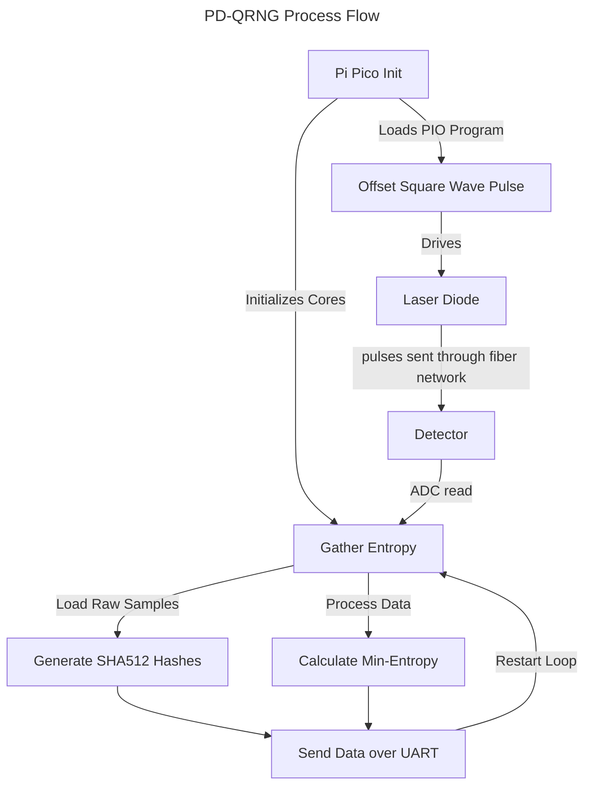

# Fiber Ranger

**An open source Phase-Diffusion Quantum Random Number Generator**

## Overview

Here's an overview of what's going on here:

```mermaid
---
title: PD-QRNG Process Flow
---

flowchart TD
    A[Offset Square Wave Pulse] -->|Drives| L[Laser Diode]
    L -->|pulses sent through fiber network| D[Detector]
    I[Pi Pico Init] -->|Initializes Cores| G[Gather Entropy]
    I -->|Loads PIO Program| A
    D -->|ADC read| G
    G -->|Process Data| M[Calculate Min-Entropy]
    G -->|Load Raw Samples| S[Generate SHA512 Hashes]
    S --> U[Send Data over UART]
    M --> U
    U -->|Restart Loop| G
```

## Optical Assembly

