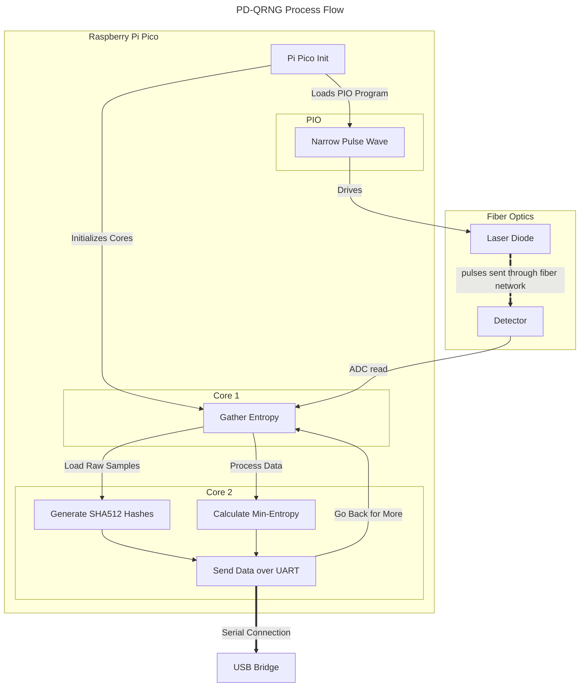
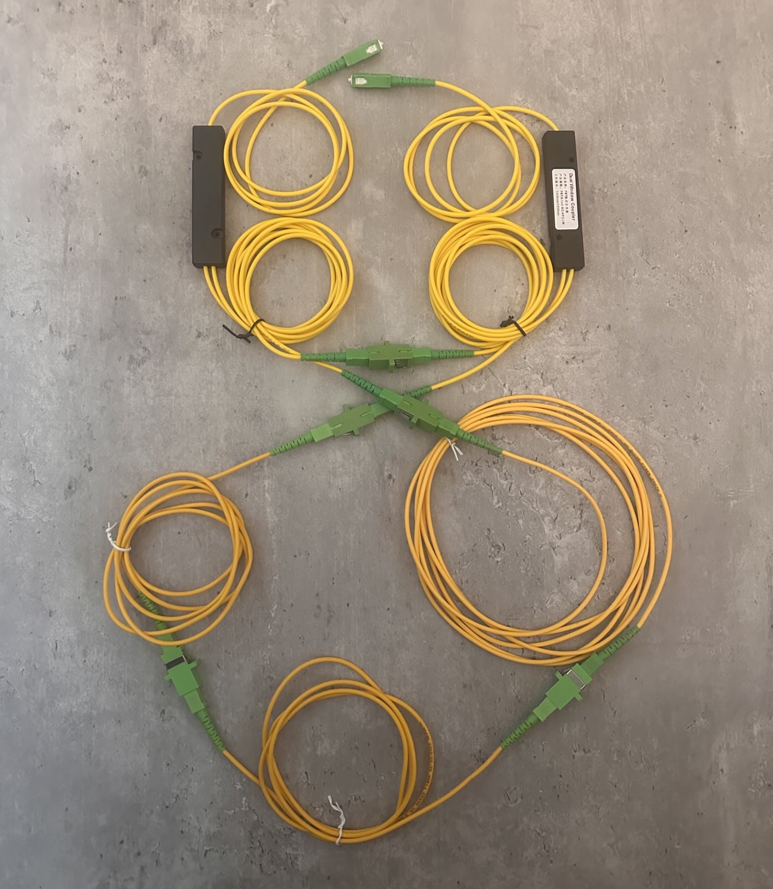
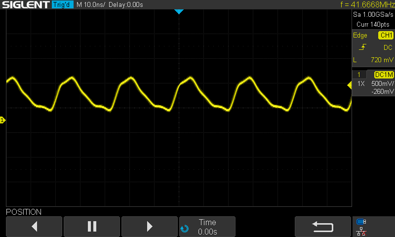
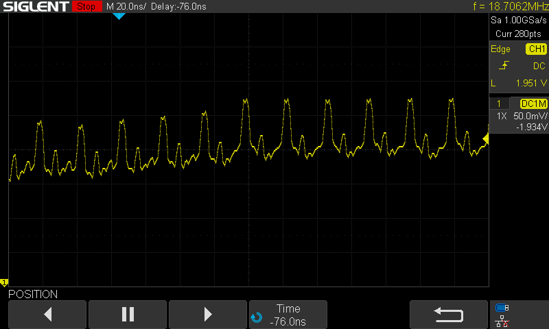
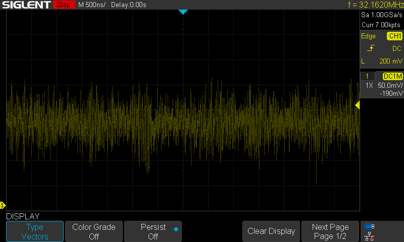
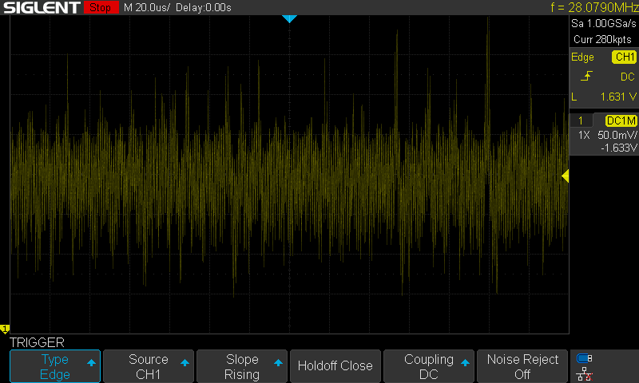
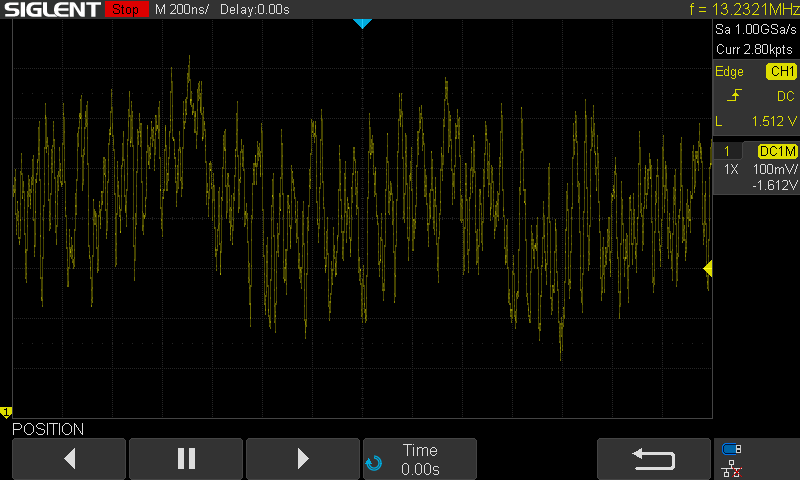
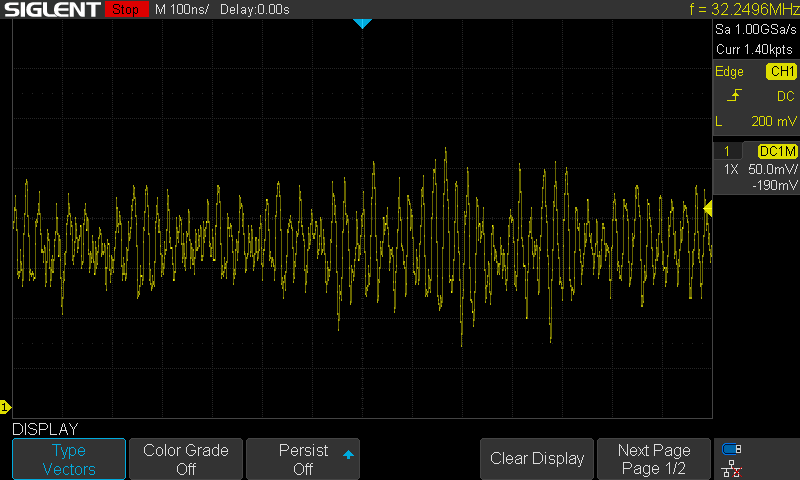
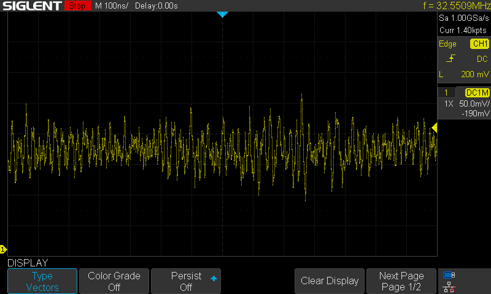
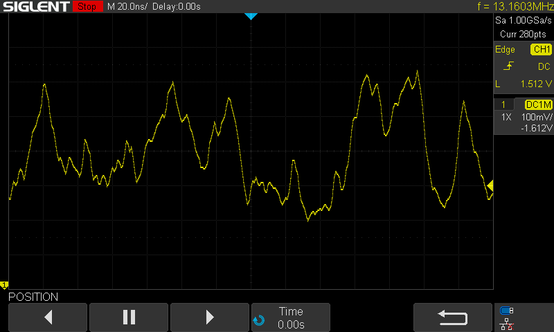

```
__/\\\\\\\\\\\\\\\________/\\\_______________________________________________                     
 _\/\\\///////////________\/\\\_______________________________________________                    
  _\/\\\______________/\\\_\/\\\_______________________________________________                   
   _\/\\\\\\\\\\\_____\///__\/\\\____________/\\\\\\\\___/\\/\\\\\\\____________                  
    _\/\\\///////_______/\\\_\/\\\\\\\\\____/\\\/////\\\_\/\\\/////\\\___________                 
     _\/\\\_____________\/\\\_\/\\\////\\\__/\\\\\\\\\\\__\/\\\___\///____________                
      _\/\\\_____________\/\\\_\/\\\__\/\\\_\//\\///////___\/\\\___________________               
       _\/\\\_____________\/\\\_\/\\\\\\\\\___\//\\\\\\\\\\_\/\\\___________________              
        _\///______________\///__\/////////_____\//////////__\///____________________             
____/\\\\\\\\\____________________________________________________________________________        
 __/\\\///////\\\__________________________________________________________________________       
  _\/\\\_____\/\\\__________________________________/\\\\\\\\_______________________________      
   _\/\\\\\\\\\\\/_____/\\\\\\\\\_____/\\/\\\\\\____/\\\////\\\_____/\\\\\\\\___/\\/\\\\\\\__     
    _\/\\\//////\\\____\////////\\\___\/\\\////\\\__\//\\\\\\\\\___/\\\/////\\\_\/\\\/////\\\_    
     _\/\\\____\//\\\_____/\\\\\\\\\\__\/\\\__\//\\\__\///////\\\__/\\\\\\\\\\\__\/\\\___\///__   
      _\/\\\_____\//\\\___/\\\/////\\\__\/\\\___\/\\\__/\\_____\\\_\//\\///////___\/\\\_________  
       _\/\\\______\//\\\_\//\\\\\\\\/\\_\/\\\___\/\\\_\//\\\\\\\\___\//\\\\\\\\\\_\/\\\_________ 
        _\///________\///___\////////\//__\///____\///___\////////_____\//////////__\///__________
```

**An open source Phase-Diffusion Quantum Random Number Generator**

## Randomness from Vacuum Fluctuations

When a laser diode powers up, there are quantum fluctuations that occur that later determine the laser's current polarization during operation. This means that if we pulse a laser diode on, then off long enough to let it totally power down, and then repeat, each pulse has unique and 'quantum random'-ly determined properties. 

We can send these pulses into an optical fiber network, and split the pulse so that ~50% goes to the detector, and the rest gets sent to a delay line - here, we use 5m length of fiber as our photonic delay line. 5m is long enough that with the timing of our pulses (roughly every 24ns) the pulse travelling over the delay loop will interact with the next pulse from the laser diode. 

The fact that each of these are different, and randomly so, means that their interactions are fundamentally chaotic and random. This is great, for a QRNG - and so this is what we estimate and measure. You can see examples of the pulses below. 

Details maybe found in the paper [Ultra-fast quantum randomness
generation by accelerated phase
diffusion in a pulsed laser diode](https://opg.optica.org/directpdfaccess/82f11558-cfa9-40df-8c448224852cc1c5_277045/oe-22-2-1645.pdf) by Abellan et al.

## System Overview

Here's an overview flowchart of what's going on in this system:



## Hardware

### Bill of Materials

**Optics:**

* 2x fiber splitters - 1x2 or 2x2
* 1x Delay line (5 meters)
* Optical connectors

For our assembly, we use SC/APC fiber connectors. These are square with angled ends that minimize reflections at any interfaces. 

**Electronics:**

* 1x Raspberry Pi Pico (or Pico 2)
* 1x Prototype Board
* 1x pair of fiber optic transceivers
* 1x 10nF ceramic capacitor
* 2x 10k Ohm resistors (through hole)
* 1x prototyping board
* Assorted connection wires

Many optical transcievers transmit/receive on 1310/1550nm or tx/rx at 1550/1310nm. (1310nm is in O-band and 1550nm is in C-band in conventional fiber optic parlance). 

### Prototype Board Assembly

The following summarises the pin assignments for the Pico:

* `GPIO0` is used as the laser driver. A PIO program is run to offload this from the CPI.
* `ADC0` is used to read the data from the receiver, running on core 0
* The USB port is used to analyse and generate the final randomness and min-entropy outputs, and is controlled from core 1. 

### Optical Assembly

This is a sketch overview of the RPi pico driver, laser/PD and splitter setup. The Delay Loop used below is 5m in length.


This is what the system looks like in hardware:



### Circuit Details

`GPIO0` and `ADC0` are used on the RPi Pico. Here are more details:

* The `3V3` and `GND` pins (3rd and 5th on RHS) are used to power the two fiber modules.
* Both an A and a B module are used - one transmits at 1310 and recieves at 1510, the other at 1510 and recieves at 1310.
* Pin 8 on the A module (`TX` positive pin) is used to drive the laser.
* Pin 2 on the B module (`RX` positive pin) is used to recieve.
* Between this `RX` pin and the `ADC0` pin, there is a small circuit that normalizes the voltage from being centered around 0V to being centered around 1.65V. This circuit is comprised of:
    * 2x 10k Ohm resistors are used. On is connected to `3V3` and the other to `GND` they form a voltage divider the middle of which is tied to `ADC0`.
    * 1x 10nF ceramic capacitor is used - this goes from `RX` to `ADC0` that has the voltage lift from the divider. 

The circuit looks like this: 


## Results 

The following show some measurement results off a six metre fiber delay loop in a MZI configuration, with a 38MHz base pulse step with 4 sleep steps following. 

This is the base pulse from the PIO program on `GPIO0`:



Here is the base pulse sent over a 1.5m loop of fiber - 



And here is the full output from the `RX` pin sent to the ADC over the interferometry network:



Here are two zoomed in portions to help show the randomness of the system:






This is a much zoomed in signal from the reciever:




## Sample Serial Output

Here is some example output from the UART connection. `H_min` is the output of the min-entropy claculation. ~7.5-8 is considered generally good. `R` is the range, and `Data` precedes two lines of `SHA512` hashes that are the condensed versions of the input entropy pools:

```bash
H_min: 8.4150 | R: 2143 | Data: 
4d318912ee23197fb3cd1d7b34211e6598e6ffe04472f108ae73d8d0016b7abe2d05d614e661052d96e582d836a5d67e742ed14b9a53f6d06265636443699fb9
805d4a764dd580dae5e12f5e98124dcbe0d18bc04bb85ff6db1c61856f27dfa348c6c85a56721219ef697bca5369dd8ec747b8bcb8c126bb98191048b7f5d071
H_min: 8.0000 | R: 2118 | Data: 
3cbb5f97760a738d55a5a412379b657f9b1e00d8cd1ece6cdbcfef160c89297bd350f49e2b09b65b3ca857d4b7c8ae22031ff5cde0ec20e7718f9392ad7fdd27
cebcfe765c7a492de9704868170446c06e79cb14240ce6282611e357ac78af2e2c2251ef8a2f5b121ed25a274ab765fce59bdf5087e826020aadc437e92637de
H_min: 8.0000 | R: 2111 | Data: 
31dcc075b3bff75d0ec9a59955cb79facaef30e46424641b53169b99c8ee090c18d49fe1e0f81b40f1a9ba365dab1a03a60d8ad7578b90a441a558bbbe7a404b
5fee5f1ddbca039d4f180d8930522e7a0d65a2579178135fd558c5c4d306b8633ae9129d30599067457160dc3c70f21d471fe908284f702dd1f65521f0eaa29a
H_min: 8.0000 | R: 2051 | Data: 
14044948623187a899179a5b19a7cfe96f21e70cf5c8376004e69b91fe7abc3109b2e93cf3210f9b2c6e0d3d7e3dee26af2c07f7b9b2d85f41a3750f603fc130
6a2f993d982725f2184f8f46bea85e62da26dde55d9ff7ca3bcdf1055c2528a3c3e878b96d46549199b494121d1f53d2df92aee95a30c9638dbca7a7558cdd4b
H_min: 8.0000 | R: 2050 | Data: 
461e888f84645867571e4e81b38afd9e55ee438daff3d63ece89b9016074923ec0a99c5599cfe6389617ab3ff5e2f59324380be268ad4906c3d279dff980e7d3
1b4ce1edfe2b073915a1b2d4a12fc77c781ce7c67673bb695fb24d8869ef991a0ee2bb9d7d92ac0eed090d918095518d6a4b184cb25571398c5c5563f2217c4c
H_min: 7.6781 | R: 2063 | Data: 
d1a417e22aa549863276817a92ae5bc4e90ee6dea0c5f0439a7bb2061af746285cc6fa09c67482eac6ebbacd7662ce9c6bd2b7f61c8df8607316e654628fd6be
34f3a7eea808ef444fc598235207b6be1e1f4130360c9618863c2b74b348dfe09571a5dbadda43e0c606ab9408dcb6fa3f6665db0d70036be2d4f3c1c94bac83
H_min: 7.6781 | R: 2123 | Data: 
78c6d63ff455fe01cf024b169416880ad81fc64ad761c053649d5bc092c5392e7e21aa97568e42da992f677e267882e5d777d8e54de03be9414177b3ae6369ab
d37ef51586b655ae1c71a0acc05c0b849cddf342c94c3f0f4aa90d2d6b29fc8b6ce9c38f1475921fd804e4553889ff5c03b89387d28706a469c569508a0d427f
H_min: 8.0000 | R: 2201 | Data: 
af52dea776ac0b7454e368da64bb0f7c9dd0087f1e718373581093839f24d886f490463c9b107538c1e7a337f7015b20b126dac5f5f28ade7333ba063791598e
7662016a6ddab7b25b3af77d06c92ac0d8e65f1f1f1948d60af6c1c6d7acb2feba76c81344583a9ad8553b6294cacdd1c275482641a0dd97cdc26a58169c9595
H_min: 8.0000 | R: 2099 | Data: 
bfc80c5b5b8e6cc94a3cc5be96ff094848908dcbef40a860f40098c148701ca960de9854f4011fc7a70ed149f39c67a79fad71da76b83b83b9038ea4a1e1fefd
f6fbc050d89ba9688acf11c657339dd6de9a4a4823844566a172e9d5c1f0c1a2a163db04952ffb339810d38418040d43372082df032a85350d883fb196402b75
H_min: 8.0000 | R: 2152 | Data: 
f06a336477fa3d08c0e73ae45e5677b3034368d2c0d5eabc1a97e6beaedc65f83929752742beeec557fdabfaf88131aef63d7a36fe7bb7d3343aad32d94f488c
74f954478da7e558cbf646792f06b1070d01ce60e5216ae33cf89708cff750639cecafe361eec5094328cba7e8c6167042d352c635d31f91bcf5408c5a8241a0
H_min: 8.0000 | R: 2180 | Data: 
4a250a740ad463f7af72427470317d94dfb577d37ecd701bd1bc6eedb34bb1cef97e7e37d0a972431e93a96f95661b05d3e5c5be828ff42643ceb2752b980b72
6399b91d5c6543b0766c1786e701a44451d65564b944d2398e1049c2dbd651db506123ae1a7300ddf92d5d23262d4e87506a9592234a3ba50d2d17b0b3aeae7f
H_min: 8.0000 | R: 2133 | Data: 
4b3f9a8f328987f261a027b8f1f9268f299eff230e8dbc4aa42a37bad4bf464a0cd3e365e385afcb83ab703d0e168207a4f503108db9ed330ddb992fdda186ea
d06c6cab31b882e7500279932b2cfb4e720c7a16913d8d4d9abee7e803c172a479da3c8ba57cbebff11c7d5bb3cc5fff4cc976ce17300fbf446d26184ed12370
H_min: 7.1926 | R: 2106 | Data: 
cbd6b6d3528c7b335844bb795f7817b164473b6a921e5165e557401dec7be1bf8d74862c1b5b71c4f1f081b80a37dda079e9c229723ecd626b2405080e3762bc
8991867d6e2f269c2ee32e184558e5bca7ca0a0133664d6f7946906f6a31a97b7993587f7ae4e06475054830a4c42346827e7cb322b90d87dc098631bc5ccf26
H_min: 8.0000 | R: 2113 | Data: 
376a863adc0f0a89c6b16987bbaef52dd87b078ff6b1395f9cd52ed1fcf8786cdedf2d42471782c6da8cc1a3765a55051ae45b9a0b2ee3c73b826f116088c750
10d1ee520c81b84f0050266a60a574fb6a31516f82fb761fd6b969bb67047e5a108cf53512e40818aef8678e0faf92f3741a256e1e0cc9885f94212444975ef8
H_min: 8.0000 | R: 2133 | Data: 
741215995de062f9b74882d0a76c40eabca706e57a7eff3464d7c3c48b55d4c49da5f7b8af8287c052654c1fb7d916171e60a659261c985679173b6568c1739c
ab2f7d96f6795fbb820b060f7d13846e284a115c99980387137ee27a50c3241412263317c7526e88f02f7ba1b83ba1fb5e427b964551d4fc22fe34044c5b0740
H_min: 8.0000 | R: 2174 | Data: 
cda76ab4a09d319a7f10d021e370d48c0e2603218e89b7188c1a3c23ae86251a8703cfd2d586f851b88973ba01f396d78606b6f29f59d1af598ad080fc491900
ceeda6e7a12e872e898947993c07e468f2c201232ed4307c185a42bde85a6ee5c49bf01cc88890d2ab3d90bbe2ef7106cb9a127c70464667172faef1488a115f
H_min: 8.0000 | R: 2140 | Data: 
a95a6b94994938e3c5e3b028d27b97dc421200e3cfc6c7432110d7ec37d1919bb1d29e430e5059c1d65fbeaa3d6250bbc8192153bc6217c646ee06cca39cce61
89c7212c89411988195f1bc05536f5ccb08b7522dab4e3bee8b2e60f076862aae24f5e0887ca45fefb20050402f4c0cacc254327474f22638d48f5ebbd1b8b14
H_min: 8.0000 | R: 2120 | Data: 
3fb5d874aabe44150c09f5a02d6948e0f5a3402f70e699d3060eeafc3c1503531bbd1a6834ea532b743e159aed88fb1996f2e1735cc7135c3a7006d4359f138f
a558f5989889b3d86e0339f1bd4dcfa8d51c093d15d96bb8bf381995a87e61d3d2eaac76081c7a747bdd824b68fe3fc658f0d39671dbe43c3c454d7b7731c476
H_min: 8.0000 | R: 2111 | Data: 
ff9bea46b4f8588a74c913e9590faba7d92536ca1001d34fb405d184407c052d3c2e80a60182b505c5ed560e1e5a48a9dfbe97f107fa306e966d174e1c9936ae
5fcf72109ed2d69293405b3f67d36c677080aec029a2bbf73d1b58a0da320e618e4cac04b722295eb3a2bd8b6821680dd775bbfa4cfcb5aabcf45fe4d9bec1a6
```

## Conclusion

This project has showed the potential for low cost, high performance, field-ready designs for PD-QRNG.

## References

The primary refernce is Abellan _et al._ "Ultrafast Quantum Randomness Generation by Accelerated Phase Diffusion in a pulsed laser diode", 2014, link: https://opg.optica.org/directpdfaccess/00ca77ad-84db-4fe1-9f0385ca69f37b45_277045/oe-22-2-1645.pdf

A secondary reference, "Quantum Entropy Source on an InP Photonic Integrated Circuit for Random Number Generation" by Abellan _et al._ is good resource for understanding vacuum fluctuations, and how they can be utilized; Link: https://opg.optica.org/optica/fulltext.cfm?uri=optica-3-9-989 
