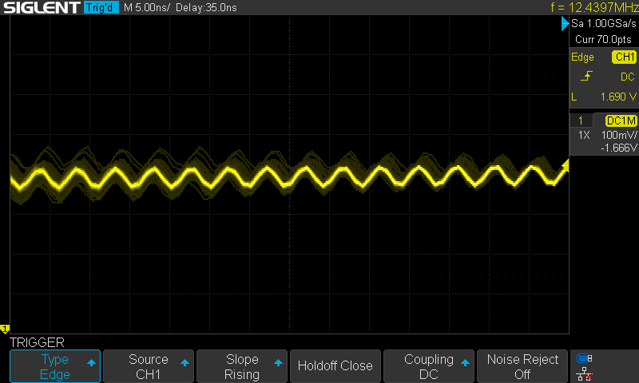
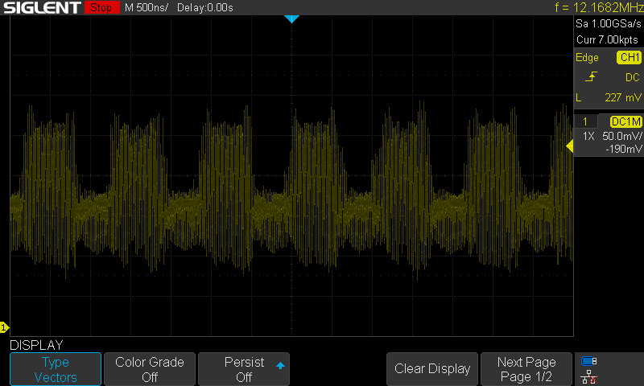

```
__/\\\\\\\\\\\\\\\________/\\\_______________________________________________                     
 _\/\\\///////////________\/\\\_______________________________________________                    
  _\/\\\______________/\\\_\/\\\_______________________________________________                   
   _\/\\\\\\\\\\\_____\///__\/\\\____________/\\\\\\\\___/\\/\\\\\\\____________                  
    _\/\\\///////_______/\\\_\/\\\\\\\\\____/\\\/////\\\_\/\\\/////\\\___________                 
     _\/\\\_____________\/\\\_\/\\\////\\\__/\\\\\\\\\\\__\/\\\___\///____________                
      _\/\\\_____________\/\\\_\/\\\__\/\\\_\//\\///////___\/\\\___________________               
       _\/\\\_____________\/\\\_\/\\\\\\\\\___\//\\\\\\\\\\_\/\\\___________________              
        _\///______________\///__\/////////_____\//////////__\///____________________             
____/\\\\\\\\\____________________________________________________________________________        
 __/\\\///////\\\__________________________________________________________________________       
  _\/\\\_____\/\\\__________________________________/\\\\\\\\_______________________________      
   _\/\\\\\\\\\\\/_____/\\\\\\\\\_____/\\/\\\\\\____/\\\////\\\_____/\\\\\\\\___/\\/\\\\\\\__     
    _\/\\\//////\\\____\////////\\\___\/\\\////\\\__\//\\\\\\\\\___/\\\/////\\\_\/\\\/////\\\_    
     _\/\\\____\//\\\_____/\\\\\\\\\\__\/\\\__\//\\\__\///////\\\__/\\\\\\\\\\\__\/\\\___\///__   
      _\/\\\_____\//\\\___/\\\/////\\\__\/\\\___\/\\\__/\\_____\\\_\//\\///////___\/\\\_________  
       _\/\\\______\//\\\_\//\\\\\\\\/\\_\/\\\___\/\\\_\//\\\\\\\\___\//\\\\\\\\\\_\/\\\_________ 
        _\///________\///___\////////\//__\///____\///___\////////_____\//////////__\///__________
```

**An open source Phase-Diffusion Quantum Random Number Generator**

## Randomness from Vacuum Fluctuations

When a laser diode powers up, there are quantum fluctuations that occur that later determine the laser's current polarization during operation. This means that if we pulse a laser diode on, then off long enough to let it totally power down, and then repeat, each pulse has unique and 'quantum random'-ly determined properties. 

We can send these pulses into an optical fiber network, and split the pulse so that ~50% goes to the detector, and the rest gets sent to a delay line - here, we use 6m as our photonic delay line. 6m is long enough that with the timing of our pulses (roughly every 30ns) the pulse travelling over the delay loop will interact with the next pulse from the laser diode. 

The fact that each of these are different, and randomly so, means that their interactions are fundamentally chaotic and random. This is great, for a QRNG - and so this is what we estimate and measure. You can see examples of the pulses below. 

Details maybe found in the paper [Ultra-fast quantum randomness
generation by accelerated phase
diffusion in a pulsed laser diode](https://opg.optica.org/directpdfaccess/82f11558-cfa9-40df-8c448224852cc1c5_277045/oe-22-2-1645.pdf) by Abellan et al.

## System Overview

Here's an overview flowchart of what's going on in this system:


## Hardware

### Bill of Materials

Optics:

* 2x fiber splitters - 1x2 or 2x2
* 1x Delay line
* Optical connectors

For our assembly, we use SC/APC fiber connectors. These are square with angled ends that minimize reflections at any interfaces. 

Electronics:

* 1x Raspberry Pi Pico (or Pico 2)
* 1x Prototype Board
* 1x pair of fiber optic transceivers
* 1x 10nF ceramic capacitor
* 2x 10k Ohm resistors (through hole)
* 1x prototyping board
* Assorted connection wires

Many optical transcievers transmit/receive on 1310/1550nm or tx/rx at 1550/1310nm. (1310nm is in O-band and 1550nm is in C-band in conventional fiber optic parlance). 

### Prototype Board Assembly

The following summarises the pin assignments for the Pico:

* `GPIO0` is used as the laser driver. A PIO program is run to offload this from the CPI.
* `ADC0` is used to read the data from the receiver, running on core 0
* The USB port is used to analyse and generate the final randomness and min-entropy outputs, and is controlled from core 1. 

### Optical Assembly

This is a sketch overview of the RPi pico driver, laser/PD and splitter setup. The Delay Loop used below is 6m in length.


This is what the system looks like in hardware:


### Circuit Details

`GPIO0` and `ADC0` are used on the RPi Pico. Here are more details:

* The `3V3` and `GND` pins (3rd and 5th on RHS) are used to power the two fiber modules.
* Both an A and a B module are used - one transmits at 1310 and recieves at 1510, the other at 1510 and recieves at 1310.
* Pin 8 on the A module (`TX` positive pin) is used to drive the laser.
* Pin 2 on the B module (`RX` positive pin) is used to recieve.
* Between this `RX` pin and the `ADC0` pin, there is a small circuit that normalizes the voltage from being centered around 0V to being centered around 1.65V. This circuit is comprised of:
    * 2x 10k Ohm resistors are used. On is connected to `3V3` and the other to `GND` they form a voltage divider the middle of which is tied to `ADC0`.
    * 1x 10nF ceramic capacitor is used - this goes from `RX` to `ADC0` that has the voltage lift from the divider. 

The circuit looks like this: 


## Results 

The following show some measurement results off a six metre fiber delay loop in a MZI configuration, with a 38MHz base pulse step with 4 sleep steps following. 

Here is the base pulse sent over a 1.5m loop of fiber - 



Here is the base pulse going over the interferometery setup but with the delay loop disconnected:



And here is the full output from the `RX` pin sent to the ADC:


Here are two zoomed in portions to help show the randomness of the system:


## Sample Serial Output

Here is some example output from the UART connection. `H_min` is the output of the min-entropy claculation. ~7.5-8 is considered generally good. `R` is the range, and `Data` precedes two lines of `SHA512` hashes that are the condensed versions of the input entropy pools:

```bash
H_min: 8.0000 | R: 1661 | Data: 
e6f84e2461da042a047d2f6550e7fddbbb0643f3a2217b9bde8ce72c78aacc29a9dff74d7d1e13629507ef84d26b4b9c88a2f3f0a9b4b483820d91b68099fd35
60826bedfd8d0b88cccb6f065bbf70a47df4be49fb930b9984996cb049dcc10230eda5b0b6bca245d16256b34e801a3b47938ce6e0ef5e28043530d1e6ecd90f
H_min: 7.6781 | R: 1597 | Data: 
07555883976c002e343e22dd6e62d220c61bef6ec36d93933c630f4bf62bb3889e189e2eb529d9b01b5e4775a9524c9fa2147ba9d12b59e002aa1ceddd853acb
7165473a0847324c7198d2bf2ac6186ef49b22f4062e59aed04c32eb13b2e1413d7450309ee8e6e10117cb9ac50abd408bb0703cebc797682857f187a5739fc1
H_min: 7.6781 | R: 1595 | Data: 
7148cceba4fe1dfb22875eb2375e1a0f573741d83ee8e8525fefafa53561e9338d0d74324e161ca09a10531ce9f397dcd089db40380567f311310bcd7467da91
ac11f74b60dea302101175faf0c522076dd8bef8388464584fb243abad80bde4259218c6558286e760602c8875c90bea7e2e3a91de8e5323b0310f38024378f5
H_min: 7.6781 | R: 1562 | Data: 
f50813f2b1ed2968d3011ee2ddb504b2a9aeac3b36207b5bdd0e619ee3300bb8386d6d48928c84bdca2bbe959eeda1811706bca2ccc5d5f8d94ba779f6b1fd49
f6e40b2dea32b9ef22af029ab046ce7c674cce12922176df20d893a2889dd258dca5d12b3134d7aae0281b9a4f7f65c4958857c0549d6afcaf6f2e42cdda7af8
H_min: 7.4150 | R: 1548 | Data: 
bc056d1f20375b4b27eb0893581540dc631d3fb6088743dde49964ca5607036181e2fd41ad35c75d18c42ebe8be9372f67378c10950f474208ee0a8508a7a5c7
d9ba85a1b19bb926fa6f09ec1d45103f655899e7ce9b8a0c2435c0694617574ba38aca24239da0bb66f06292668196ea3101620a45ed1dc44d77a4943422e07c
H_min: 7.6781 | R: 1706 | Data: 
b5f251f05ecbde90888cc9eec046ef8c12ee5d7e02da7bf9aac1468b6541ac12e960fc2827fefa64dbfab29cc19a3db72c5698b0e3458b778cb9a0d70ea4ed0d
40c4af270a45bdf0657dbcd4e421a50a9235f8cc0031da16811b4fc7bea6ad930d37e7000a40140f130869b2ee02dd82866296cfacd79ca8251669fd3e97785f
H_min: 7.6781 | R: 1611 | Data: 
c623a7a0166511c8bc53c7785536a29db9eb289f467245cce156bd41700bbd20548c4774647ea7e3878e04f46047dad6119e65f132804e63dd90890624dad090
32d3ec03f74fbb250309991d04d645db30d3b88eec292bda26bb41377d6a3bfdc19de14b812cacc85834e0c6a6ee264f048e799b620e156c78f191922b3e7804
H_min: 7.6781 | R: 1604 | Data: 
fc72f7b78ae8372d336eeed35ad00a289716bbe4c26519803068688468bd6189c8ba5356684c4405f51d9f84988444ac1e810e58ec733a59809fb2cb0b14bf3c
0ed546a48c183e1d95098d4d7cdd19bc16fdb0018daec6ced9698a197f2b1dd7cda14afd0324298693ba0326445ad5020abf15f3d60c9b14ec0fbd25697a709c
H_min: 7.6781 | R: 1685 | Data: 
e7b1c71e70796a727e0df3f96d2b830da6aa37347a3ad647ca3c55130d277036845d04b47b4c933aa86a3d44e7b55f67d4c9d9a188ed82074c9f3e8155e0caa0
201a91a370c1ecbd40bd9b084c2a975f77b2d6fca1bcfb4e8786de2eb9d48f85a141bdf79d226b9ae719d8e83d7245f965d0f66aa7a08383a4d464dfbf1bf1ef
H_min: 7.6781 | R: 1591 | Data: 
0d56bf146815be3e3b56dc6216a6281cf3ba656b3e5c03a763934f0de9a5991004701f8e257bac722d98f3aeed7e503f620ef67346ded543283440d711efd45b
f178cb4275e54a508793f52068363ba75b36a2e3149bdc964e2a9f436915c006fdcde170c8d6c3d92bb1da7b07e693c39928607ab75e9c84e7e71892210a2de4
H_min: 8.0000 | R: 1667 | Data: 
cd91d71e9679faabfed01ece833fbb560461086e5ea7f86bf94198d342d4dd0f14a743c95ba278dbcc5e456a516f32f8f377432a65d49f3b8070a7702b375020
8166eeee9089a1eb2f126f58894ab74ff439305e9f9cddbce5ee224eaa2cd799df4905e3df09d739ebb1a4aa6413aa6f07fa5359e6280a45c16024d82d8fda10
H_min: 8.0000 | R: 1721 | Data: 
906f69c15f509647f80fef52c0744ba4d8ba9b25cd0c8fa7444dde52e0ce0cd0b6a732aae196c8ed224e1db14ccb52a2f455cdcf32daf3af6c5ced916bbce894
9dcfa9910c2650d2cadb82c6408305f30517dd21b3e5162a46033d47df009f1b336380d70b27f311f1d3bc76b662cca9735ec2797dc9f769de95e54cbd34effe
H_min: 8.0000 | R: 1539 | Data: 
b5418c0b41faa3f91d5be2a225670b8d67885301019fec58869eca428069eaf6aff9de5e63a5f29994cc02a155513ccbb8be934745e38c94c5452bf96412b007
6c61bbbb095d56db4517f3016bac926dfb20c3d9fefc9797818b7a56709ef6d603beef6bba761b1157c9cd6594beb9f856a6562d296b3b309a778818bae8f7e2
```

## Conclusion

This project has showed the potential for low cost, high performance, field-ready designs for PD-QRNG.
